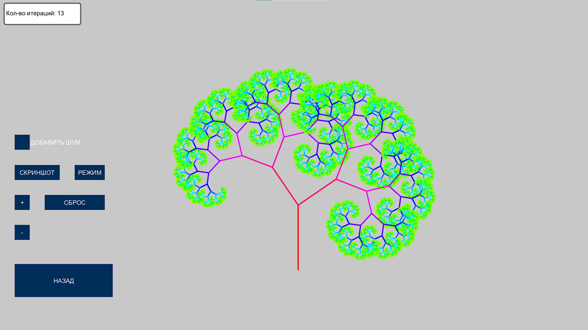
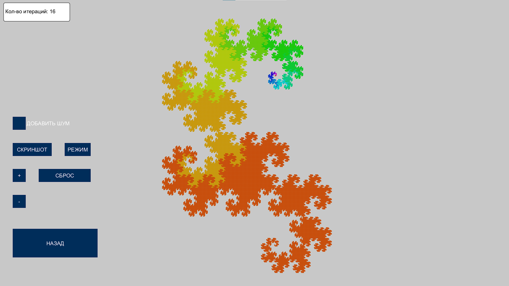
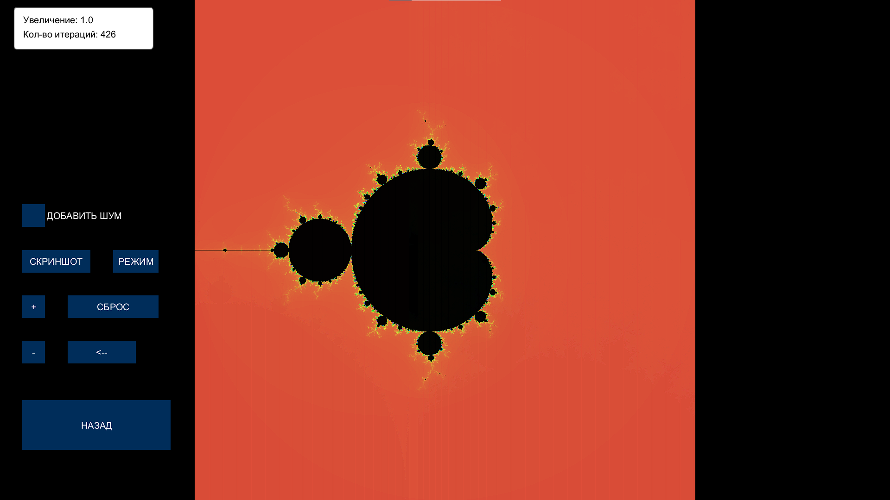
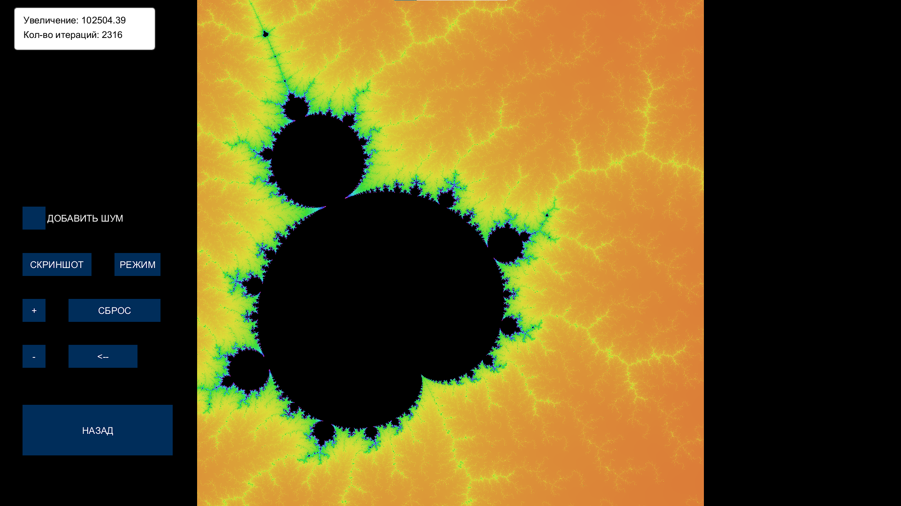
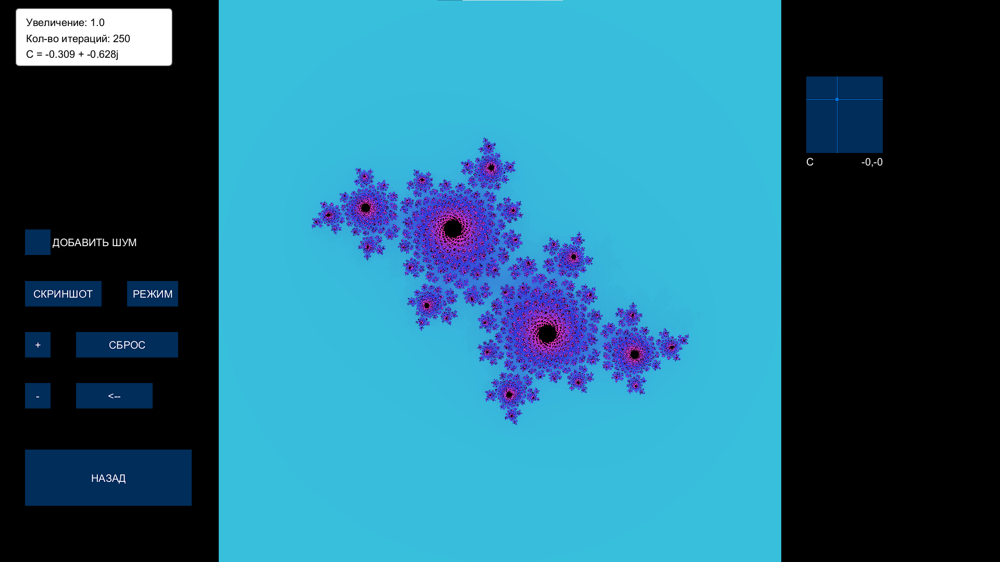
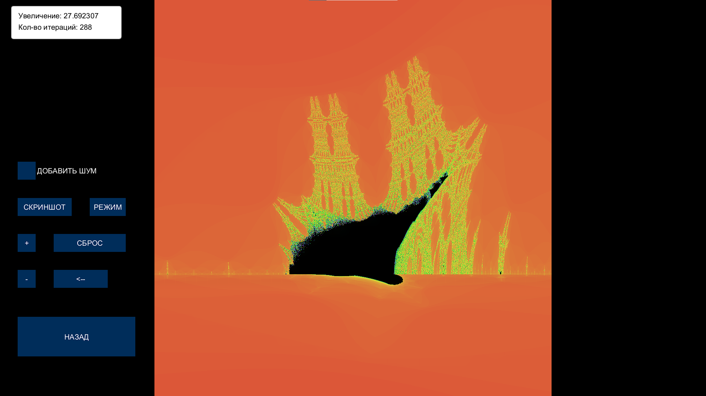

# Simple-Fractal-Explorer

## Установка

- Собрать/запустить скетч при помощи Processing IDE.

- Собранный exe есть в релизах, для работы нужны java sdk
-  (+ готовая папка со всем необходимым на яндекс.диске)

## Демонстрация работы

## 1. Дерево Пифагора
- Приближение колёсиком мыши
  

## 2. Кривая дракона

## 3. Динамические фракталы
- Приближение при помощи выделения области, рендер плавный
- ### Множество Мандельброта

 
 

- ### Множество Жюлиа

 

- ### Горящий корабль

 

 ## Известные ошибки

 Визуальные баги 